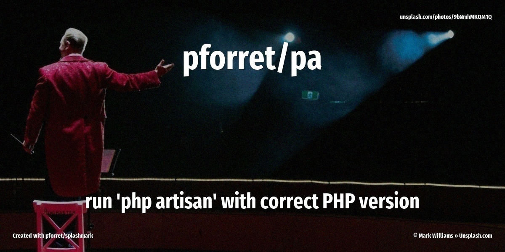

[](https://basher.gitparade.com/package/)

# pa



Run `php artisan` and `composer` with the correct PHP version for the project, derived from composer.json

## 🔥 Usage

```
Program : pa  by peter@forret.com
Version : v0.0.3 (2022-09-26 20:04)
Purpose : php artisan replacement
Usage   : pa [-h] [-q] [-v] [-f] [-l <log_dir>] [-t <tmp_dir>] <action> <input …>
Flags, options and parameters:
    -h|--help        : [flag] show usage [default: off]
    -q|--quiet       : [flag] no output [default: off]
    -v|--verbose     : [flag] also show debug messages [default: off]
    -f|--force       : [flag] do not ask for confirmation (always yes) [default: off]
    -l|--log_dir <?> : [option] folder for log files   [default: /home/pforret/log/pa]
    -t|--tmp_dir <?> : [option] folder for temp files  [default: /tmp/pa]
    <action>         : [choice] action to perform  [options: install,update,versions,check,update,env]
    <input>          : [parameters] input file/text (1 or more)
```

## ⚡️ Examples

```bash
# run `php artisan`, but with the correct PHP version for this project
$ pa make:model ModelName

# run `composer install`, with the correct PHP version
> pa install

# run `composer update`, with the correct PHP version
> pa update

# run `composer require` author/package, with the correct PHP version
> pa require author/package

# show all available PHP versions on this machine
> pa versions
/usr/bin/php8.2                PHP 8.2.0       ✅  Supported until 2025-12-08
/usr/bin/php8.1                PHP 8.1.13      ✅  Supported until 2024-11-25
/usr/bin/php8.0                PHP 8.0.26      ✅  Supported until 2023-11-26
/usr/bin/php7.4                PHP 7.4.33      ⛔  Unsupported since 2022-11-28
/usr/local/bin/composer        Composer 2.5.1 2022-12-22 15:33:54
```

## 🚀 Installation

with [basher](https://github.com/basherpm/basher)

	$ basher install pforret/pa

or with `git`

	$ git clone https://github.com/pforret/pa.git
	$ cd pa

## 📝 Acknowledgements

* script created with [bashew](https://github.com/pforret/bashew)

&copy; 2022 Peter Forret
